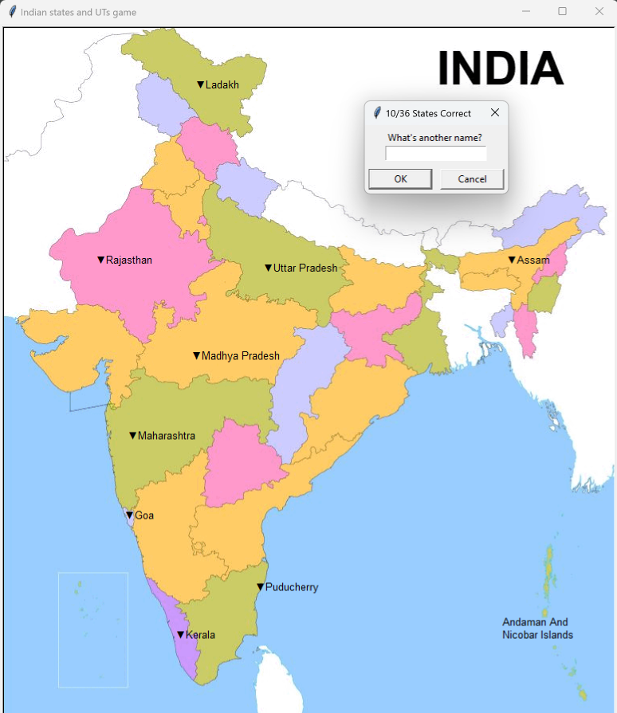

# Indian States and UTs Guessing Game

This is an interactive Python game where users attempt to name all 28 states and 8 Union Territories (UTs) of India. The program will show an image of the map of India and ask users to input state and UTs names. If a correct name is entered, it will be displayed on the map. The game also generates a file with the names of any states the player missed.

   > built using `Python`, `Pandas` and `Turtle`



## Checkout the web version of this game [Play](https://guessindia.vercel.app/) | [Code](https://github.com/Rahullkumr/GuessIndianStatesAndUTs/tree/web-version)

   > built using `HTML`, `CSS` and `JavaScript`

## Features
- Displays a map of India with a blank outline of the states and UTs.
- Allows users to guess states' and UTs' names and shows correct guesses on the map.
- Generates a `names_you_missed.csv` file listing any states or UTs not guessed during the game.

## Prerequisites
1. **Python 3.x**: Ensure Python is installed. You can download it from [Python.org](https://www.python.org/).
2. **Pandas**: Install the `pandas` library for data manipulation:
   ```
   pip install pandas
   ```
3. **Turtle Graphics**: The `turtle` module is a standard Python library, so no additional installation is needed.

## Project Structure
- `main.py`: Main game file containing the code to run the game.
- `states_and_uts.csv`: CSV file with state and UT names and their coordinates.
- `map_of_India.gif`: Image of the India map outline used as the game background.

## Getting Started

1. **Clone the repository**: Clone the project to your local machine using Git.
   ```
   git clone https://github.com/Rahullkumr/GuessIndianStatesAndUTs.git
   ```

2. **Navigate to the project directory**:
   ```
   cd GuessIndianStatesAndUTs
   ```

3. **Ensure all required files are in the directory**:
   - `main.py`
   - `states_and_uts.csv`
   - `map_of_India.gif`

## Running the Game

To start the game, execute the following command:
```
python main.py
```

## How to Play

1. When the game starts, a prompt will appear asking for a state or UT name.
2. Type the name of a state or UT and press Enter.
3. If the state/UT name is correct, it will appear on the map at the state's or UT's location.
4. Type "Exit" if you want to stop the game early.
   - When you exit, a `names_you_missed.csv` file will be created in the project directory, listing any name you did not guess.

## Note

- Ensure that `map_of_India.gif` is present in the same directory as the code. If it's missing, the game will not display the background map.

## Author
- Created by me [Rahul Kumar](https://github.com/rahullkumr)

Enjoy learning and challenging yourself with this Indian states and UTs guessing game!
