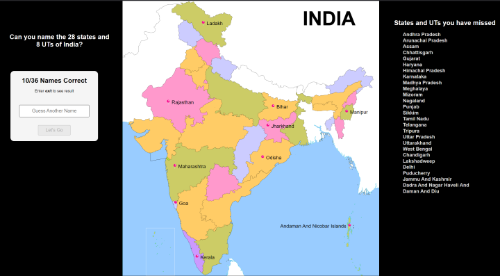

# Indian States and UTs Guessing Game (web-version)

This is an interactive game where users attempt to name all 28 states and 8 Union Territories (UTs) of India. The game will show an image of the map of India and ask users to input state and UT names. If a correct name is entered, it will be displayed on the map. The game also tells the user the names of any states or UTs he/she missed.

   > built using `HTML`, `CSS` and `JavaScript`

## Let's see how much you score [click here](https://guessindia.vercel.app/)

## Features
- Displays the map of India with a blank outline of the states and UTs.
- Allows users to guess states' and UTs' names and shows correct guesses on the map.
- Generates the output listing any states or UTs not guessed during the game.

## How to Play

1. When the game starts, a prompt will appear asking for a state or UT name.
2. Type the name of a state or UT and press Enter.
3. If the state/UT name is correct, it will appear on the map at the state's or UT's location.
4. Type "Exit" if you want to stop the game early.
   - When you exit, output will be visible on the right side, listing any name you did not guess.

## Author
- Created by me [Rahul Kumar](https://github.com/rahullkumr)

Enjoy learning and challenging yourself with this Indian states and UTs guessing game!
